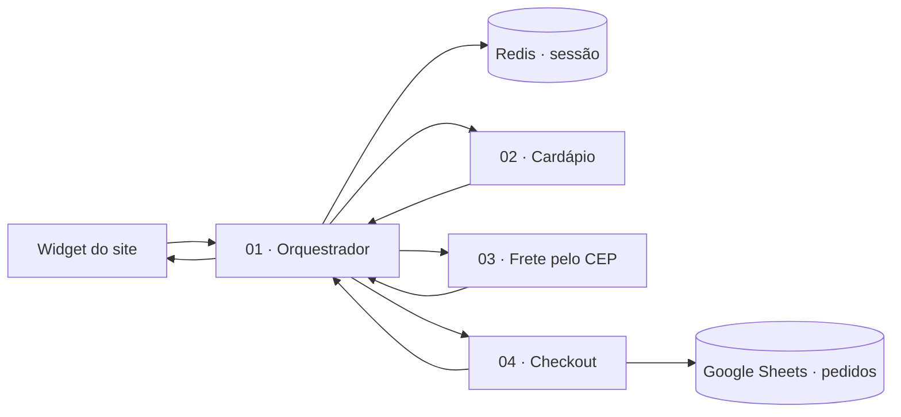

# Pedido Demo · Rebecca's Pizzaria

Workflows n8n que sustentam a demonstração de um agente conversacional para pedidos. O projeto recebe uma mensagem do site, mantém o contexto da sessão, consulta especialistas para cardápio, frete e checkout, e devolve a próxima resposta para a interface.

> Este repositório contém exports sanitizados para estudo, documentação e reimportação. Credenciais, identificadores internos, URLs de produção e IDs de planilhas foram removidos.

## O que este projeto demonstra

- Orquestração de um agente conversacional com subworkflows especializados.
- Memória de sessão em Redis para preservar contexto entre mensagens.
- Cardápio e regras de negócio separados do agente principal.
- Consulta de frete por CEP.
- Checkout com confirmação explícita antes do registro do pedido.
- Integração com Google Sheets para persistir pedidos confirmados.
- Contrato simples entre frontend e automação, com suporte a idioma.

## Arquitetura



## Workflows

| Arquivo | Responsabilidade |
| --- | --- |
| `01-chat-site-atendimento.json` | Entrada do site, normalização, memória Redis e roteamento para especialistas. |
| `02-sub-cardapio.json` | Consulta e apresentação do cardápio da Rebecca's Pizzaria. |
| `03-sub-frete-cep.json` | Consulta de endereço, cálculo e apresentação do frete. |
| `04-sub-checkout.json` | Revisão do carrinho, confirmação e registro do pedido. |

## Contrato com o site

A interface envia um payload semelhante a:

```json
{
  "sessionId": "demo-session-id",
  "text": "Quero uma pizza de calabresa",
  "locale": "pt-BR",
  "stage": "menu",
  "cart": []
}
```

A resposta esperada pelo frontend é:

```json
{
  "reply": "mensagem da Rebecca"
}
```

O campo `locale` orienta o idioma da resposta. O `sessionId` identifica a memória da conversa. O carrinho é mantido pelo cliente e validado pelo fluxo antes do checkout.

## Como importar

1. Abra uma instância n8n compatível com os nodes usados nos exports.
2. Importe os quatro arquivos JSON pela interface de workflows.
3. Reassocie as credenciais nos nodes de OpenAI, Redis e Google Sheets.
4. Substitua os placeholders de webhook e de planilha.
5. Configure uma aba de pedidos no Google Sheets com as colunas esperadas pelo node de checkout.
6. Publique o orquestrador e os subworkflows depois de validar as conexões.
7. Aponte o frontend para o webhook publicado do orquestrador.

Os arquivos foram exportados do ambiente de demonstração e podem exigir pequenos ajustes de versão dos nodes ou de parâmetros de credencial durante a importação.

## Segurança e dados

Nenhuma credencial deve ser versionada neste repositório. Os exports publicados aqui não incluem IDs de credencial, tokens, URLs internas, webhook IDs ou identificadores reais de planilhas. Antes de usar os workflows em produção, revise permissões, retenção de execuções, logs e acesso à planilha.

O checkout da demonstração deve registrar um pedido somente após confirmação explícita do cliente. A experiência pública do site não processa pagamento real.

## Snapshots da UI

A pasta `docs/images` está reservada para capturas do canvas n8n, úteis para explicar a arquitetura no README. Elas podem ser adicionadas depois de uma revisão visual dos quatro workflows, sem incluir dados sensíveis na tela.

## Relação com o site

O frontend da demonstração vive no repositório [rafael-site](https://github.com/Nunes-Rafael/rafael-site). Este repositório concentra a automação n8n para que a evolução do site e dos workflows possa ser versionada separadamente.

## Licença

Uso pessoal e demonstrativo. Consulte o autor antes de reutilizar os fluxos em um contexto comercial.

